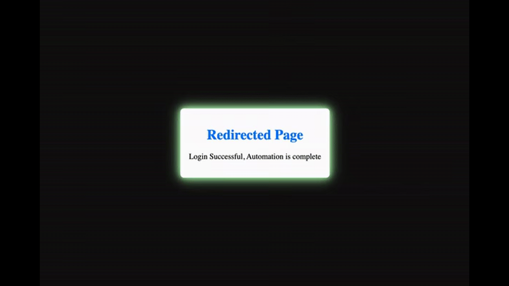

# Login Automation with Cypress




## Description

This repository contains a simple example of login automation using Cypress. The project demonstrates how to automate the login process on a login form and handle different scenarios such as successful login and invalid credentials.

## Prerequisites

- [Node.js](https://nodejs.org) and npm installed on your machine.

## Installation

1. Clone the repository to your local machine:

```bash
git clone https://github.com/your-username/login-automation-cypress.git
```

## Navigate the Project folder

```
cd login-automation-cypress
```
2. Install dependencies using `npm`:
```
npm install
```
## Usage
1. To open the cypress Test Runner,run:
   ```
   npx cypress open
   ```
  1. Click on the login_spec.js file in the Cypress Test Runner to run the login automation test.

3. The test will open a browser and perform the login actions. You will see the test results in the Cypress Test Runner.

## Customization
You can You can customize the **index.html** and **script.js** files in the project to match the login form of your application. Update the Cypress test in cypress/e2e/login_spec.cy.js accordingly to handle the specific behavior of your login form.

## License
This project is licensed under the [MIT License](LICENSE).

## Contributing

Contributions are welcome! If you find any issues or want to enhance the automation, feel free to create a pull request.


## Support

For any questions or suggestions, please :email: [open an issue](https://github.com/JubairRahman/cypress-gist-downloader/issues) or reach out to me on :briefcase: [LinkedIn](https://www.linkedin.com/in/jubair-rahman0/) or :speech_balloon: [Discord](https://discord.com/channels/1102626546142957679/1102626547262820374).


---

Happy automating! 🚀
